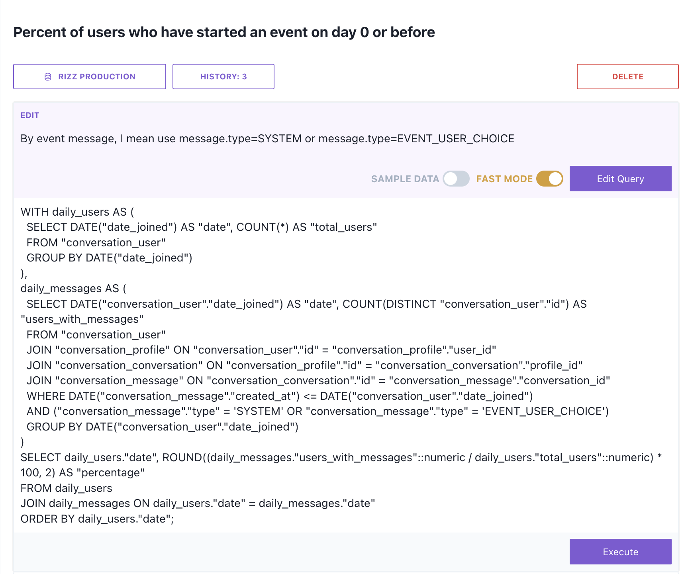

> 👾 📢 Join our [Discord](https://discord.gg/4DGNMe6pzW) or email us at [founders@aisqlgen.com](mailto:founders@aisqlgen.com) for updates, support, and more!

# AI SQL Gen

Don't write SQL by hand. Use LLMs to link to your SQL database, then generate, edit SQL, and auto-generate visualization. Run it locally.


## ⚡ Quick Start

Pre-requisites: OpenAI API Key, Postgres Database (more database support coming soon)!

1. Install

```
yarn
```

2. Start

```
cd frontend
yarn dev
```

3. Open http://localhost:3000

4. Input your OpenAI API Key


5. Add your datasource


6. Generate or edit your query!

## Features

### 1. Create a query

A "query" is a single notebook for which you can iterate on a SQL statement with natural language. You can create more by clicking 'create new query'.


### 2. Generate a query

Write plain-text in the input box to generate the appropriate sql query. Run generate.

The more descriptive the question is, the better the performance will be.


->


The above SQL query is generated in one-shot.

### 3. Edit / fix a query

However, other times, the query may not be generated properly and may not run.

We understand that your databases are not open source datasets. We know that they have complex data. We know that you may have pre-existing queries that you want to edit.

The UI is designed such that you can make modifications on the SQL by hand manually. You can also copy and paste the SQL script to begin with. Add plain-text description on how you want the query to be edited. Run edit and wait for the magic!


->



You can see that the WHERE clause is added to the query properly given the context.

### 4. Run the query and generate a chart

With a simple description, you will be able to visualize your data. Currently, we've only tested charts that would work with Chart.js, but we will be able to support all types of visualization in the near future.

For 60~70% of the time, 3.5 is sufficient to generate the query, and since it's a lot cheaper and faster, we leave it as an option. If you end up with an error, typically switching on 4 makes things just work.


### 5. View history

For each query item you set up, you can view its history.


## Architecture


Blue represent user inputs and purple represent generated artifacts. We use next.js API routes for conveniency since it runs on Node. The routes establish connection with the Database and LLM (currently GPT).

### Security

All data is saved locally - none of your API Key or data source information is shared with anyone else. Down the road when we have a hosted version, we will encrypt the information.

## Roadmap

1. More database connectors
2. More visualization outside of Chart.js
3. Email us at founders@aisqlgen.com
